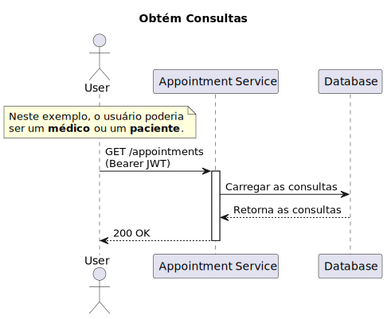
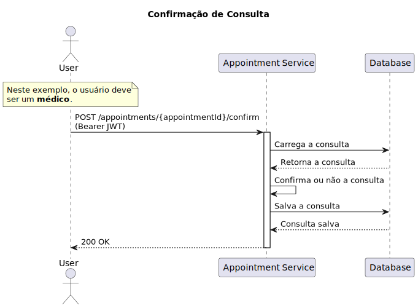
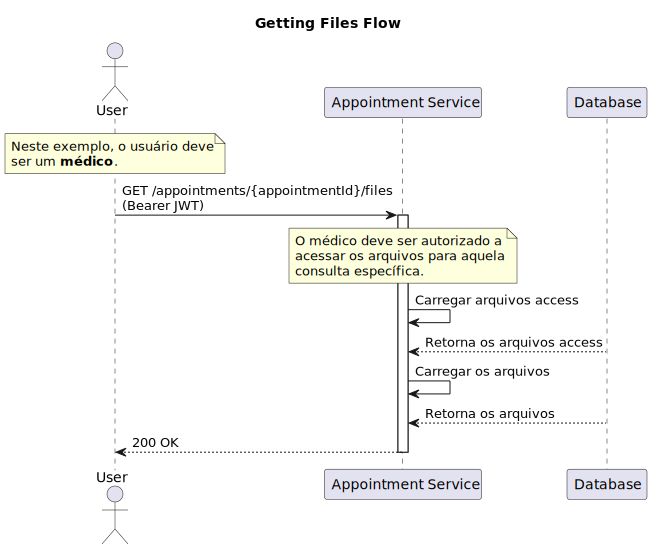

# Appointment Service

Serviço responsável pela gestão dos agendamentos.

# Desenvolvimento Local

## Requisitos

- [Terraform](https://www.terraform.io/downloads.html)
- [Terraform Docs](https://github.com/terraform-docs/terraform-docs)
- [AWS CLI](https://aws.amazon.com/cli/)

## Implantação manual

### Atenção

Antes de implantar o cluster, certifique-se de definir as variáveis ​​de ambiente `AWS_ACCESS_KEY_ID` e `AWS_SECRET_ACCESS_KEY`.

Esteja ciente de que esse processo levará alguns minutos (~4 minutos) para ser concluído.

Para implantar o cluster manualmente, execute os seguintes comandos em ordem:

```bash
make init
make check # this will execute fmt, validate and plan
make apply
```

Para destruir o cluster, execute o seguinte comando:

```bash
make destroy
```

## Implantação Automatizada

A implantação automatizada é acionada por uma GitHub Action.

# Rotas

| Método | Rota                                                              | Descrição                                       | Papel do Usuário |
| ------ | ----------------------------------------------------------------- | ----------------------------------------------- | ---------------- |
| POST   | `/appointments`                                                   | Cria uma consulta via evento                    | Paciente         |
| GET    | `/appointments`                                                   | Obtém todas as consultas                        | Médico/Paciente  |
| GET    | `/appointments/{appointmentId}`                                   | Obtém uma consulta por ID                       | Médico/Paciente  |
| PUT    | `/appointments/{appointmentId}`                                   | Atualiza uma consulta                           | Paciente         |
| POST   | `/appointments/{appointmentId}/confirm`                           | Confirma ou recusa uma consulta                 | Médico           |
| POST   | `/appointments/{appointmentId}/cancel`                            | Cancela uma consulta                            | Médico/Paciente  |
| POST   | `/appointments/{appointmentId}/feedbacks`                         | Adiciona feedback a uma consulta via evento     | Paciente         |
| GET    | `/appointments/{appointmentId}/feedbacks`                         | Obtém feedbacks                                 | Médico/Paciente  |
| GET    | `/appointments/{appointmentId}/feedbacks/{feedbackId}`            | Obtém feedback por ID                           | Médico/Paciente  |
| GET    | `/appointments/{appointmentId}/files`                             | Obtém todos os arquivos anexados a uma consulta | Médico           |
| POST   | `/files`                                                          | Atualiza arquivos                               | Paciente         |
| GET    | `/files`                                                          | Obtém todos os arquivos                         | Paciente         |
| GET    | `/files/{fileId}`                                                 | Obtém um arquivo por ID                         | Paciente         |
| POST   | `/files/{fileId}/access`                                          | Cria um acesso de arquivo                       | Paciente         |
| GET    | `/files/{fileId}/access`                                          | Obtém todos os acessos de arquivo               | Paciente         |
| POST   | `/appointments/{appointmentId}/medical-reports`                   | Cria um prontuário médico                       | Médico           |
| GET    | `/appointments/{appointmentId}/medical-reports`                   | Obtém todos os prontuários médicos              | Médico           |
| GET    | `/appointments/{appointmentId}/medical-reports/{medicalReportId}` | Obtém um prontuário médico por ID               | Médico           |

# Diagramas

## Criação de Consulta

Neste diagrama, podemos ver o fluxo simplificado de criação de uma consulta.


## Obtém as Consultas

Neste diagrama, podemos ver o fluxo simplificado de obtenção de consultas.



## Enviar Feedback

Neste diagrama, podemos ver o fluxo simplificado de envio de feedbacks.


## Obtém Feedbacks

Neste diagrama, podemos ver o fluxo simplificado de obtenção de feedbacks.


## Confirmar ou Recusar uma Consulta

Neste diagrama, podemos ver o fluxo simplificado de confirmação de uma consulta.



## Cancelar uma Consulta

Neste diagrama, podemos ver o fluxo simplificado de cancelamento de uma consulta.


## Upload de Arquivo

Neste diagrama, podemos ver o fluxo simplificado de upload de um arquivo.


## Acesso de Arquivo

Neste diagrama, podemos ver o fluxo simplificado de gerenciamento de acesso de arquivo.


## Obtém Arquivos da Consulta

Neste diagrama, podemos ver o fluxo simplificado de obtenção de arquivos.



## Criação de um Prontuário Médico

Neste diagrama, podemos ver o fluxo simplificado de criação de um prontuário médico.


# Licença

Este projeto é licenciado sob a Licença MIT - veja o arquivo [LICENSE](LICENSE) para detalhes.